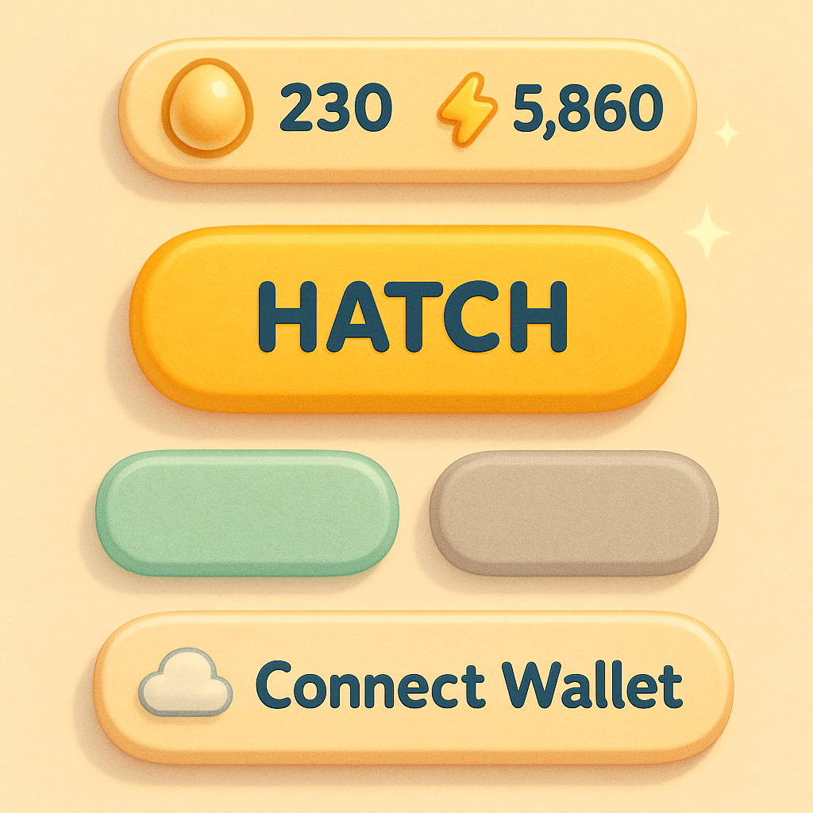
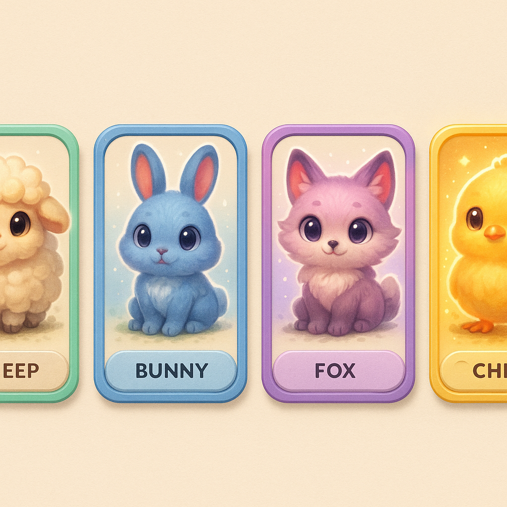
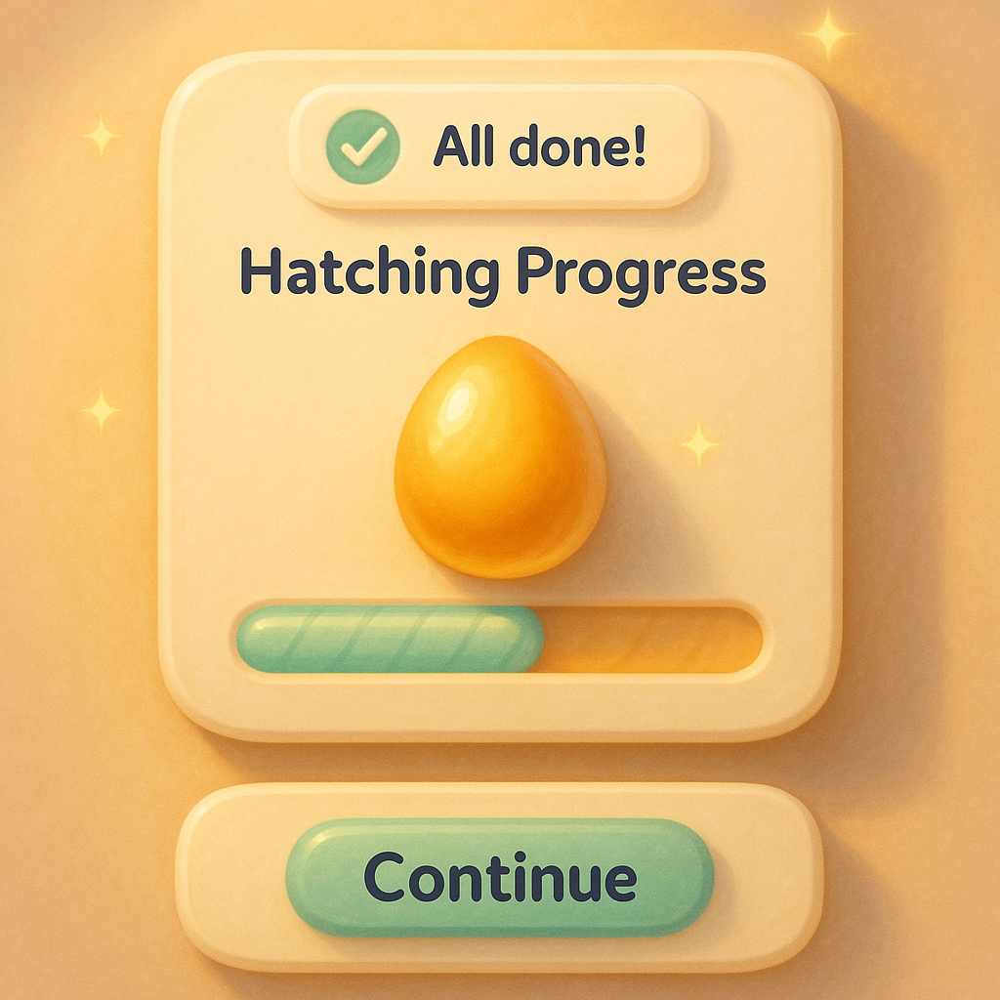

# 🧩 Pocket Hatchery — UI Kit & Design Tokens (UI-KIT.md)

> ชุดส่งมอบให้ engineer หยิบไปสร้างเว็บได้ทันที (ผู้เล่นทั่วไปเข้าผ่าน **WAX Cloud Wallet / MyCloudWallet**)
> ยึด North Star + palette + rarity tiers จาก [`ART.md`](./ART.md) · Quality bar = `art/references/creature-rare-hero.png`
> เขียนโดย Monanisa (Designer) · v0.1 · 2026-06-26

---

## 0. มีอะไรในกล่องนี้ (deliverables)

| ไฟล์ | คืออะไร | dev ใช้ยังไง |
|---|---|---|
| `art/ui-kit/tokens.css` | **CSS custom properties** — สี/spacing/radius/typography/shadow/motion + scrollbar | `@import "./tokens.css"` ที่ root แล้วใช้ `var(--ph-*)` ได้เลย |
| `art/ui-kit/tokens.json` | Token เดียวกันในรูป JSON | ป้อน Style Dictionary / Tailwind config / นำเข้า design tool |
| `art/ui-kit/ui-kit-preview.html` | **Live preview** ทุก component (กดได้จริง ใช้ tokens จริง) | เปิดในเบราว์เซอร์เพื่อ inspect spec + เห็น state/juice/scrollbar จริง |
| `art/ui-kit/mockup-*.png` | ภาพ mockup 3 board ตามสไตล์ cozy-premium | mood + visual target เวลา implement |

> **หลักการเดียว:** `tokens.css` กับ `tokens.json` คือ source of truth ตัวเดียวกัน — แก้ที่นี่ที่เดียว ห้าม hardcode hex ในคอมโพเนนต์.

---

## 1. Design Tokens

### 1.1 Color (อ้าง ART.md §3)
Brand: `--ph-color-cream #FFF6E9` · `--ph-color-golden #FFCB6B` (CTA) · `--ph-color-mint #8FD694` · `--ph-color-coral #FF9EB5` · `--ph-color-lavender #C9A8FF` · `--ph-color-sky #A8DCF0` · `--ph-color-earth #C49A6C` · `--ph-color-ink #3A3A52` (text).

Surfaces: `--ph-surface-canvas` / `--ph-surface-raised #FFF` / `--ph-surface-sunken #F3E7D2` (track/well) · `--ph-scrim rgba(58,58,82,.45)`.

Text: `--ph-text-primary #3A3A52` · `--ph-text-muted #7C7A92` · `--ph-text-on-golden #3A3A52` (**ไม่ใช้ขาวบนปุ่มทอง**).

State: success `#5BB572` · warning `#FFB347` · danger `#F2728C` · info `#5FB8E8`.

**Rarity** (frame / aura / badge): common `#8FD694` · rare `#5FB8E8` · epic `#B07BE8` · legendary `#FFD86B` (+iridescent). แต่ละตัวมีคู่ `--ph-rarity-*-aura` เป็น rgba สำหรับ glow.

### 1.2 Spacing — 4px grid
`--ph-space-1..8` = 4 / 8 / 12 / 16 / 24 / 32 / 48 / 64 px.

### 1.3 Radius
`sm 12` · `md 16` · `lg 20` · `xl 24` (การ์ด) · `2xl 28` (modal/sheet) · `pill 999` (ปุ่ม/แถบ).

### 1.4 Typography (ART.md §4)
Display/หัวเรื่อง = **Baloo 2** · Body/UI = **Nunito** (600/700) · ตัวเลข = Nunito tabular · ไทย = **Mali**.
Scale: `display 40/48` · `h1 32/40` · `h2 24/32` · `h3 20/28` · `body 16/24` · `label 15/20` · `caption 13/18`.
ปุ่ม/touch target ขั้นต่ำ **44×44px** (`--ph-touch-min`).

### 1.5 Elevation (เงานุ่มฟุ้ง โทนอุ่น ไม่ใช่เงาเทาคม)
`--ph-elev-1` chips/resource bar · `--ph-elev-2` card/button · `--ph-elev-3` modal/sheet · `--ph-glow-golden` (ไข่/CTA) · `--ph-glow-legendary` (การ์ด legendary).

### 1.6 Motion (ART.md §7 "juice")
Duration: `instant 80 · fast 140 · base 220 · slow 360 · evolve 900` ms.
Easing: `standard` · `decelerate` · **`pop`** (overshoot สำหรับเด้งปุ่ม) · `spring` (bottom-sheet).
Preset เด่น: **buttonPress** `scale 1→0.96→1.04→1` @220ms `pop`.
> มี `@media (prefers-reduced-motion)` ปิด animation ให้อัตโนมัติ (accessibility).

---

## 2. คอมโพเนนต์หลัก + สเปก (token ที่ใช้จุดต่อจุด)

### 2.1 ปุ่ม (Button)

| ตัวแปร | พื้น | ตัวอักษร | เงา | หมายเหตุ |
|---|---|---|---|---|
| **Primary** | `--ph-color-golden` | `--ph-text-on-golden` | `--ph-elev-2` (+`--ph-glow-golden` ตอน hover) | CTA หลัก เช่น HATCH |
| **Secondary** | โปร่ง | `--ph-color-meadow` | `inset 0 0 0 2px --ph-color-mint` | ปุ่มรอง |
| **Disabled** | `--ph-surface-sunken` | `--ph-text-disabled` | none | `cursor:not-allowed` |

State ครบ: `default · hover · pressed (scale .96) · disabled · focus (outline 3px --ph-border-focus)`.
ทุกปุ่ม `min-height:44px` · `border-radius:pill` · `font:label`. **Juice:** กด primary → keyframe `pop`.

### 2.2 การ์ดสัตว์ + กรอบ rarity (Creature Card)

- `border-radius:--ph-radius-xl` · `padding:--ph-space-3` · `box-shadow:--ph-elev-2`
- **กรอบ** = `4px solid var(--frame)` โดย `--frame` map จาก `data-rarity` → `--ph-rarity-{tier}`
- aura พื้นหลังภาพ = `--ph-rarity-{tier}-aura` (radial)
- **Legendary** เพิ่ม `--ph-glow-legendary` + กรอบ iridescent (`border-image` gradient ทอง→ลาเวนเดอร์) + แนะนำ aura ขยับเบาๆ
- มุมขวาบน = badge stage/level, ล่าง = name plate + tier label สีตามกรอบ
- hover: `translateY(-4px)` ด้วย easing `pop`
> **Accessibility:** ห้ามสื่อ rarity ด้วยสีอย่างเดียว — มี **tier label ข้อความ + badge** เสมอ (เผื่อตาบอดสี ตาม ART.md §3).

### 2.3 แถบ Resource (EGG / Energy)
- container: `--ph-surface-raised` · `radius:pill` · `--ph-elev-1` · สูง 40px · gap `--ph-space-3`
- ค่าตัวเลขใช้ `--ph-font-numeric` + `tabular-nums` (ตัวเลขไม่ขยับเวลาเปลี่ยนค่า)
- ไอคอนไข่มี `--ph-glow-golden`; คั่นด้วยเส้น `--ph-border-soft`

### 2.4 แถบ Progress (ฟัก / วิวัฒนาการ)

- track: `height 14px` · `radius:pill` · `--ph-surface-sunken` + inset shadow
- **fill ฟัก** = gradient `--ph-color-golden`→`#FFE3A6` + `--ph-glow-golden`
- **fill วิวัฒนาการ** = gradient `--ph-color-lavender` + glow ม่วง (สื่อ "evolution moment")
- transition `width --ph-dur-slow --ph-ease-decelerate`

### 2.5 Toast
- `radius:pill` · `--ph-elev-2` · สูง 40px · slide-in จากบน (`--ph-dur-base` `decelerate`)
- variant: success (dot `--ph-success`) · danger (dot `--ph-danger`) — มีไอคอน ✓/! ไม่พึ่งสีอย่างเดียว

### 2.6 Modal & Bottom-sheet
- ฉากหลังคลุมด้วย `--ph-scrim`
- **Modal:** กลางจอ · `radius:2xl` · `max-width 420px` · `--ph-elev-3` · เข้าแบบ `pop`
- **Bottom-sheet:** ชิดล่าง · `radius-top:2xl` · มี grabber · เลื่อนขึ้นด้วย `--ph-ease-spring` (`--ph-dur-slow`)

### 2.7 ปุ่ม Connect Wallet (WCW)
- สไตล์ neutral การ์ดขาว + ไอคอน ☁️ (สื่อ Cloud Wallet) · `inset 2px --ph-border-soft`
- hover เปลี่ยนขอบเป็น `--ph-border-focus`
- **บริบทเชน** (จาก WALLET-INTEGRATION.md): **WCW (MyCloudWallet) ใช้ได้ทั้ง testnet และ mainnet** — โชว์ **WCW + Anchor ทั้งสอง chain** ไม่ถอด WCW ออกจาก testnet; ผู้ใช้เลือก wallet ตอน login. (dev ทดสอบบน testnet อาจใช้ Anchor + faucet key ก่อนเพราะเซ็นด้วย private key ตรงๆ ได้ ไม่ต้องพึ่ง passkey/popup)
- ⚠️ **dev note:** `sessionKit.login()` ต้องเรียกใน `onClick` ตรงๆ (user gesture) ไม่งั้นโดน popup blocker — UI จึงต้องให้ผู้ใช้ "กดปุ่มนี้" เป็น trigger เสมอ
- หลัง login: ปุ่มกลายเป็น account chip (ชื่อบัญชี + balance) — ใช้ resource-bar style ซ้ำได้

---

## 3. Slim blue-glass scrollbar (ลายเซ็นออฟฟิศ)
อยู่ใน `tokens.css` แล้ว ครอบ `*` ทั้งหน้า: thumb `rgba(95,184,232,.55)` (hover `.8`), width `8px`, `radius:pill`, `backdrop-filter:blur(2px)`, track โปร่ง. ใช้ได้ทั้ง WebKit (`::-webkit-scrollbar`) และ Firefox (`scrollbar-color`). เห็นจริงในส่วน "Office blue-glass scrollbar" ของ preview.

---

## 4. Accessibility checklist (ส่งต่อ dev)
- ตัวอักษรหลัก `--ph-text-primary` บน cream → contrast > 4.5:1 (WCAG AA); ปุ่มทองใช้ label navy (~7.9:1)
- touch target ≥ 44×44px ทุกปุ่ม
- rarity / state สื่อด้วย **สี + ไอคอน + ข้อความ** เสมอ (ไม่พึ่งสีเดี่ยว)
- focus ring มองเห็นชัด `3px --ph-border-focus`
- `prefers-reduced-motion` ปิด juice/anim อัตโนมัติ

---

## 5. ทำต่อ (next)
1. แตก component เป็น React/Vue + map tokens เป็น props/variants (หรือ Tailwind preset จาก `tokens.json`)
2. แทนอีโมจิ placeholder ในการ์ดด้วย creature sprite จริง (ตาม naming ART.md §9)
3. ทำ evolution-moment animation (flash + particle) — ผูก `--ph-dur-evolve` + lavender glow
4. ทำ token เวอร์ชัน Figma variables ให้ design↔code ตรงกัน
5. ประสาน Yamamoto (เว็บ/WharfKit) เรื่อง state ของ Connect Wallet ตาม chain (mainnet/testnet gating)
